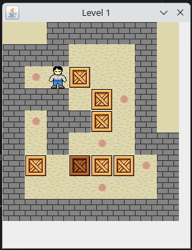
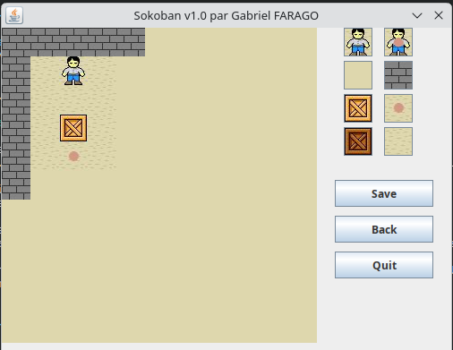

# Sokoban Game - Java Implementation

[](https://opensource.org/licenses/MIT-0)  

## Table of Contents

- [Introduction](#Introduction)
- [Installation](#Installation)
- [Build Instructions](#Build-Instructions)
- [Game Controls](#Game-Controls)
- [Game Classes](#Game-Classes)
- [Conclusion](#Conclusion)
- [License](#license)

## Introduction

[Sokoban](https://en.wikipedia.org/wiki/Sokoban) is a classic puzzle game where the player must push boxes onto designated spots in order to complete the level. The player controls a character that can move up, down, left, and right and push boxes. The game is won when all boxes are on the designated spots.

This project is a fork of a [nice Sokoban implementation](https://github.com/Gimligili/Sokoban.Java),
enhanced with modern development practices.
The original implementation has been updated with the following key improvements:

- **Build System**: Migrated to Maven for dependency management and build automation
- **Testing**: Added unit tests using JUnit 5, AssertJ, and Mockito
- **Code Quality**: Integrated static analysis tools including:
  - Error Prone for catching common programming mistakes
  - NullAway for compile-time null safety checking
  - Maven Compiler Plugin with strict compilation flags
- **Modern Java**: Upgraded to use Java 24 features
- **Dependencies**: Added useful libraries like Guava and StreamEx for improved functionality

## Screenshots

### Gameplay
<div style="text-align: center">

<div><em>Level 1 - The main game screen showing the player, boxes, and target locations</em></div>
</div>

### Level Editor
<div style="text-align: center">

<div><em>The built-in level editor for creating and modifying game levels</em></div>
</div>

## Installation

To play the Sokoban game, you need to have Java installed on your computer. Once you have Java installed, you can download the game files from the repository and compile them using a Java compiler.

## Build Instructions

### Prerequisites
- Java Development Kit (JDK) 24 or later
  - Example installation method using [SDKMAN!](https://sdkman.io/):
    ```bash
    # Install SDKMAN! (if not already installed)
    curl -s "https://get.sdkman.io" | bash
    source "$HOME/.sdkman/bin/sdkman-init.sh"
    
    # Install Java 24
    sdk install java 24-tem
    sdk use java 24-tem
    ```
- Apache Maven 3.6.0 or later (can also be installed via SDKMAN! with `sdk install maven`)

### Building the Project

1. **Clone the repository** (if you haven't already):
   ```bash
   git clone <repository-url>
   cd Sokoban.Java
   ```

2. **Build the project** using Maven:
   ```bash
   mvn clean package
   ```
   This will:
   - Compile the source code
   - Run the tests
   - Package the application into a JAR file in the `target` directory

### Running the Game

After building, you can run the game using either of these methods:

1. **Using Maven**:
   ```bash
   mvn exec:java -Dexec.mainClass="main_game"
   ```

2. **Using the generated JAR**:
   ```bash
   java -jar target/sokoban-1.0-SNAPSHOT.jar
   ```

   > Note: The JAR file will be named based on the `artifactId` and `version` defined in `pom.xml`

### Development

- **Compile the project**: `mvn compile`
- **Run tests**: `mvn test`
- **Create a distributable JAR**: `mvn package`
- **Clean build**: `mvn clean install`

### IDE Support

You can import the project into any Java IDE that supports Maven. The project contains the necessary Maven configuration (`pom.xml`) for easy setup in IDEs like IntelliJ IDEA, Eclipse, or VS Code with the Java extension pack.

## Game Controls

The Sokoban game is controlled using the arrow keys on the keyboard. The character moves one square at a time in the direction of the arrow key pressed. If there is a box in the way, the character will push the box in the direction of the arrow key. The game is won when all the boxes have been moved to their designated storage locations.

## Game Architecture

The Sokoban game is implemented using a Model-View-Controller (MVC) architecture with the following key components:

### Core Game Logic (`logic` package)
- [`Case.java`](src/main/java/logic/Case.java): Represents a single cell in the game grid, containing information about its contents (wall, floor, target) and any movable objects (player, box).
- [`Controller.java`](src/main/java/logic/Controller.java): Handles game state management, move validation, and game progression.
- [`Direction.java`](src/main/java/logic/Direction.java): Enumerates possible movement directions (UP, DOWN, LEFT, RIGHT).
- [`GameAction.java`](src/main/java/logic/GameAction.java): Defines possible game actions and their outcomes.
- [`TileType.java`](src/main/java/logic/TileType.java): Enumerates different types of tiles (WALL, FLOOR, TARGET, etc.).
- [`Warehouse.java`](src/main/java/logic/Warehouse.java): Represents the game level, including the grid layout and game state.
- [`Worker.java`](src/main/java/logic/Worker.java): Represents the player character with movement capabilities.

### User Interface (`ihm` package)
- [`Editor.java`](src/main/java/ihm/Editor.java): The main level editor interface for creating and modifying game levels.
- [`HomeWindow.java`](src/main/java/ihm/HomeWindow.java): The main menu screen with options to play, edit, or exit.
- [`LevelEditorSetup.java`](src/main/java/ihm/LevelEditorSetup.java): Dialog for setting up new levels in the editor.
- [`LevelSelection.java`](src/main/java/ihm/LevelSelection.java): Screen for selecting which level to play or edit.
- [`SokobanPanel.java`](src/main/java/ihm/SokobanPanel.java): The main game panel that renders the current game state.
- [`SokobanWindow.java`](src/main/java/ihm/SokobanWindow.java): The main application window that contains the game panel.
- `*Handler.java`: Various event handlers for user interactions.

### Game Flow
1. The game starts with `SokobanWindow` showing the main menu.
2. Players can select a level or enter the level editor.
3. During gameplay, `Controller` processes moves and updates the `Warehouse` state.
4. The `SokobanPanel` renders the current game state based on the `Warehouse` model.
5. The level editor allows creating and modifying levels with a visual interface.

## Conclusion

The Sokoban game is a challenging and enjoyable puzzle game that requires strategy and planning to solve. With its multiple levels, undo feature, and sound effects, it provides hours of entertainment for players of all ages. Thank you for considering this game for your entertainment needs.

## License

This project is licensed under the terms of the MIT License with Attribution. See [LICENSE](LICENSE) for more information.
